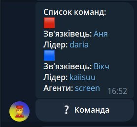
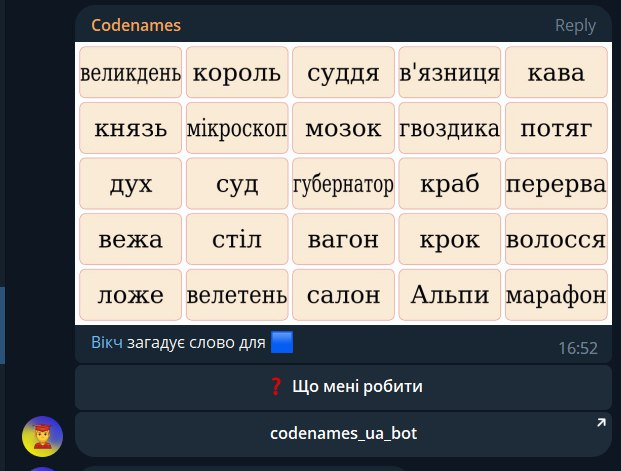
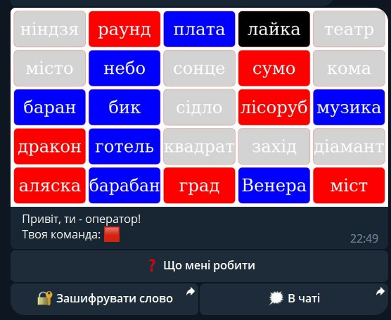
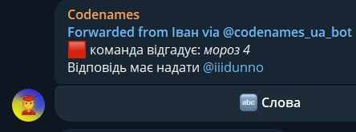
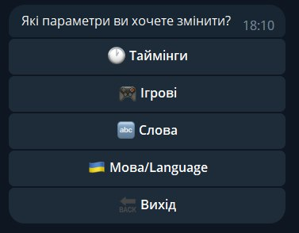
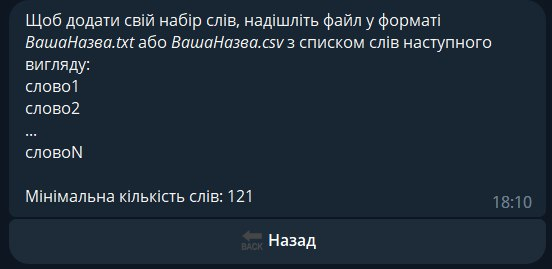
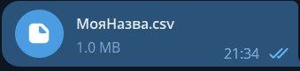

Кодові імена
codenames_ua_bot • September 7, 2023 at 21:42
Привіт, це сторінка бота @codenames_ua_bot. Він дозволяє грати в «Кодові імена» в Телеграмі!

Більшість функцій безкоштовні, але є і платні. Це потрібно для оплати серверу бота та підтримки розробників. Проте всі базові опції для повноцінного досвіду гри вам доступні 😉

Опис гри
В стандартній грі є дві команди — червона та синя. У кожної команди є зв'язківці, лідери, агенти та картинка з набором слів. Слово може належати одній з команд, бути білим або чорним. Якщо команда обирає чуже слово (синє/червоне), то віддає очко протилежній команді. Якщо команда обирає чорне слово, то одразу програє. Якщо ж біле – хід переходить до наступної команди, але очки не втрачаються. Ціль кожної з команд швидше знайти всі свої слова.

Більша кількість команд (3-6) чи більша кількість слів ніяк не впливають на правила гри. Умови ті ж самі.

Зв'язківець має придумати асоціацію для одного чи декількох слів, у той час як Агенти мають зрозуміти, які слова загадав Зв'язківець. Наприклад, слова «літак» і «машина», зв'язківець може поєднати словом «транспорт 2». Двійка в цьому випадку означає кількість слів, які хотів асоціювати Зв'язківець. Якщо Агенти правильно називають 2 слова (або стільки слів, скільки загадали в асоціації), то можуть назвати ще одне додатково.

Ще приклади: слова «сніг» та «пінгвін» можна поєднати одним словом «Антарктида». Обовʼязково вкажіть кількість асоціацій – 2.

Слово «русалка» можна пояснити іменем персонажа, написавши «Аріель 1».

Якщо Агенти не можуть зрозуміти, яке слово було загадане, то можуть пропустити хід.

Є 2 окремі випадки підказок:

«Стіна 0». Це означає, що жодне слово не стосується «стіни». При цьому, Агенти можуть називати необмежену кількість слів.
«Стіна необмежено». Це означає, що необмежена кількість слів стосується стіни. Кількість вгадувань теж не обмежена, проте це краще використовувати, якщо накопичились слова з попередніх раундів.
Опис гри у боті
Основна концепція збережена, є деякі модифікації. Головною відмінністю від гри у реальному світі в тому, що обирає слово одна людина — Лідер команди, а не всі разом. Він має відповідати за всю команду, поки Агенти допомагають йому.

Початок гри
1. Для початку гри необхідно перейти до @codenames_ua_bot і прописати /start.

2. Натисніть на кнопку «Додати бота в свій чат» і додайте бота в чат для гри, надавши йому необхідні права адміністратора.

3. Пропишіть команду /game@codenames_ua_bot і розпочинайте реєстрацію на гру.

4. Якщо набереться мінімальна кількість гравців (4), то гра розпочнеться автоматично.

Хід гри
1. У чат надсилається список команд:

2. У чат приходить картинка зі словами, асоціації для яких мають вигадувати Зв'язківці:

3. Зв'язківцям теж приходять слова, але в ПП із ботом:

4. Зв'язківець загадує слово:

5. Це слово приходить в чат:

6. Обрання слова Лідером відбувається аналогічно до обрання слова Зв'язківцем, за винятком списку слів та можливості пропустити хід. Після обрання приходить наступне повідомлення:

Налаштування
Таймінги
Можна налаштувати початковий час для реєстрації,
Увімкнути час на хід Зв'язківця і налаштувати його,
Увімкнути час на хід Агентів і налаштувати його.
Ігрові
Пін реєстрації — дозволяє закріпити повідомлення про реєстрацію в чаті,
⭐️ Видалення картинок — видалить медіа з чату, коли гра закінчиться,
⭐️ Реєстрація по командах — дозволяє реєструватись кожному в ту команду, яку він забажає,
Окрема реєстрація зв'язківців — дозволяє реєструватись Зв'язківцям та Агентам окремо,
Шпигун — додає зрадника в команду. Він виграє, якщо його команда програє,
Гардкор — режим, в якому немає білих карток,
Без пасу — режим, в якому не працює кнопка «Пас»,
Мовчанка інших команд — видає мут гравцям, які пишуть не у свій хід,
Більше картинок — надсилатиме зображення ігрової дошки після кожного ходу (якщо зможе),
Картки на команду — дозволяє зменшити стандартну кількість карток на команду у грі (з 9:8 до 8:7),
⭐️ Кількість команд — дозволяє змінити кількість команд від 2 до 6,
⭐️ Кількість слів — дозволяє налаштувати кількість рядків та стовпців зі словами. Максимальна кількість слів: 121.
Набори слів
У бота є можливість додати свій набір слів на чат. Для цього виконайте наступні дії:

1. Зайдіть у налаштування:

2. Натисніть кнопку слова та оберіть «Додати»:

3. Створіть файл і надішліть його боту:

4. Натисніть «обрати» у попередньому повідомленні і оберіть ваш набір слів:

Умовні позначення:

⭐️ — платне налаштування.
Модифікації
На відміну від стандартної гри, тут необмежена кількість агентів та збільшена кількість команд. Також можна збільшити кількість слів, при цьому, чорних завжди буде на 1 менше за кількість команд, тому нічия не можлива.

Новою роллю є Шпигун, яку ми знайшли на теренах англійських правил для Кодових імен. Йому надсилається поле зі словами ворожої команди та чорні. Він виграє у тому випадку, якщо його команда програє. Якщо в команді лишається недостатньо гравців (хтось лівнув), то програє. Заборонено підказувати своїй команді, щоб ті випадково не взяли не своє слово.

Список чатів
Кожен чат може потрапити у список чатів. Для цього є команда /add_chat_to_list@codenames_ua_bot

Чат може самостійно зникати, з'являтись, і щодня оцінюється. Потрібен мінімальний актив, інакше чат буде видалено.

Для перевірки статусу чату є команда /chat_list_status@codenames_ua_bot

Не можна додавати чати з наявними в них російськими ботами

Поради для кращої гри
Для новачків ми радимо зіграти кілька разів зі стандартними налаштуваннями, щоб зрозуміти, що до чого. Шпигуна радимо лише досвідченим гравцям, бо роль Шпигуна у новеньких виконує кожен новенький.

Для Зв'язківців
Завжди враховуйте досвід своєї команди і спосіб мислення. Не всі можуть зрозуміти ваші асоціації.
Передивіться всі слова. Можливо, до вашої асоціації також підійде вороже, чорне або нейтральне слово.
Якщо у вашої команди забагато відклалося невідгаданих слів, варто взяти експертну підказку (0 або необмежено).
Не панікуйте, якщо в суперника залишилось мало слів. Можливо, їх важко пов'язати, тому ви зможете відігратись у додатковому раунді.
Якщо ваша команда в попередньому раунді взяла не ті слова, які ви хотіли, можете їм про це натякнути загадкою в необмежено.
Для Агентів
Передивіться всі слова. Відмітьте очевидні асоціації. Якщо їх не загадують, ви будете розуміти, що слова належать різним командам.
Завжди враховуйте мислення вашого Зв'язківця. Для деяких людей піаніно асоціюється з інструментом, для інших лише з музикою.
Враховуйте різні варіанти пояснень. Наприклад: літак -> транспорт 2 <- тролейбус. Приклад 1: обробка 3 -> доїння -> молоко -> сир.
Якщо лідер загадує необмежено в неочікуваній ситуації, можливо, варто придивитися до попередніх загадок. Ймовірно, ви відгадали інше слово.
Для Шпигунів
Намагайтесь розглядати завжди максимальну кількість асоціацій, що можуть прийти в голову, це допоможе заплутати вашу команду.
Спробуйте вигадувати неочевидні зв'язки, але не перестарайтесь з цим.
